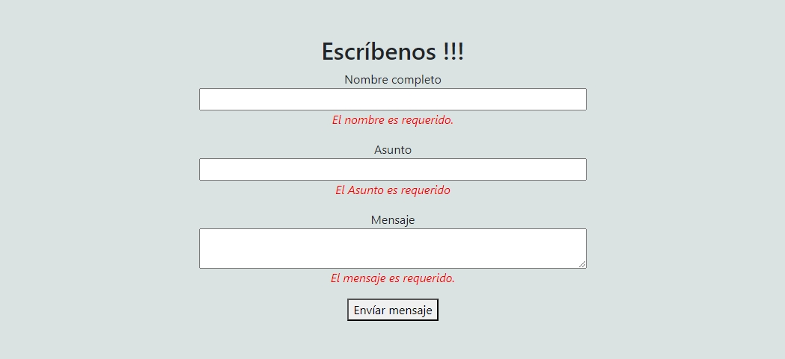
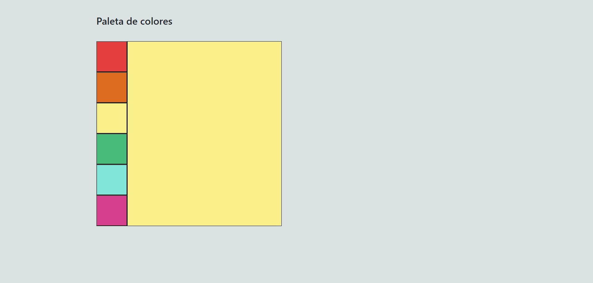

# Desafío Evaluado- JavaScript en práctica

1. Desarrollar un código para validar un formulario de contacto utilizando el evento submit y las expresiones regulares que permitan el ingreso de caracteres desde la “Aa” hasta la “Z-z” mediante el método test() de JavaScript, mostrando un mensaje de error y/o éxito cuando corresponda. Es decir, el usuario deberá obligatoriamente ingresar datos en el formulario y que estos solo sean caracteres alfabéticos de la “a” hasta la “z” para poder enviar la información. 

2. A partir de un selector de colores, cambia el color del cuadro principal al hacer click sobre uno de los colores. 

3. Dar la funcionalidad de sumar y restar a la calculadora, mostrando el resultado en el elemento con clase resultado. Si el resultado de la resta entrega un número negativo debes mostrar un 0.

