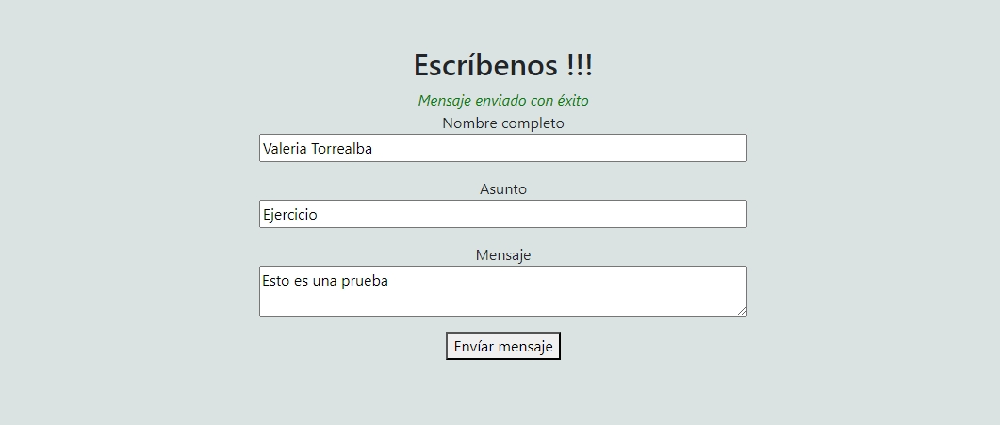

# Desafío Evaluado - JavaScript en Práctica

## Descripción

Este desafío consta de tres ejercicios prácticos diseñados para poner a prueba tus habilidades en JavaScript. Cada ejercicio está orientado a aplicar diferentes conceptos y técnicas del lenguaje.

## Instrucciones

1. Abre el archivo `index.html` en un navegador.
2. Utiliza los botones para acceder a cada uno de los ejercicios.
3. Revisa el código y las capturas de pantalla para entender la funcionalidad implementada.

## Ejercicios

### Ejercicio 1: Validación de Formulario

Desarrolla un código para validar un formulario de contacto utilizando el evento `submit` y expresiones regulares. El formulario debe permitir solo caracteres alfabéticos (de la “A” a la “Z” y de la “a” a la “z”) mediante el método `test()` de JavaScript. Debes mostrar un mensaje de error si los datos ingresados no cumplen con este criterio o un mensaje de éxito si el formulario se envía correctamente.

- **Captura de Pantalla**:

    
  
    
  
    

### Ejercicio 2: Selector de Colores

Implementa un selector de colores que permita cambiar el color de un cuadro principal al hacer clic sobre uno de los colores disponibles.

- **Captura de Pantalla**:

    

### Ejercicio 3: Calculadora Básica

Desarrolla una calculadora con funcionalidad para sumar y restar. El resultado debe mostrarse en un elemento con la clase `resultado`. Si el resultado de la resta es un número negativo, debes mostrar un `0`.

- **Captura de Pantalla**:

    

## Autor

Este proyecto fue desarrollado por **Valeria Torrealba**.
